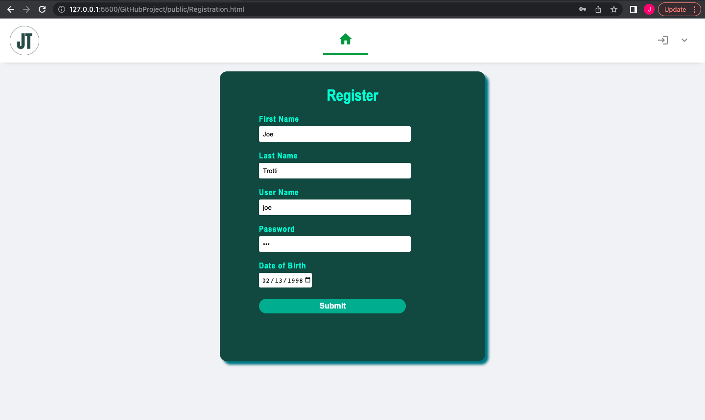
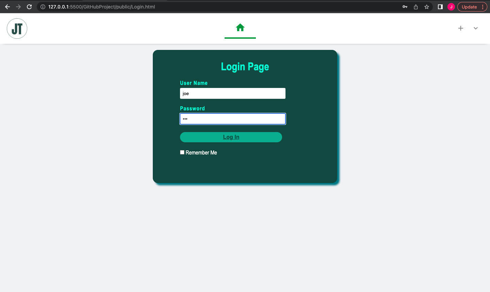
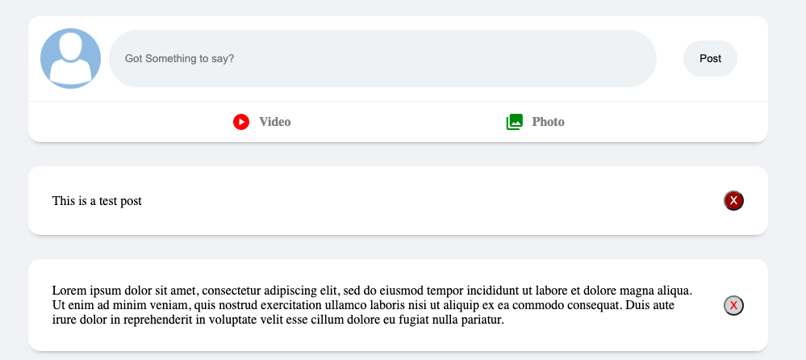
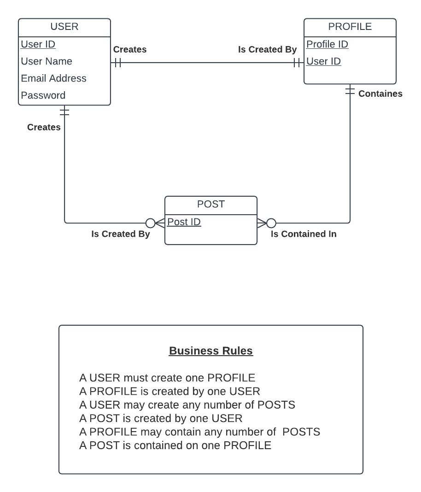

# JT Social

 A new social media platform in its early stages designed to connect with others. In the wepage's current state a *User* can register , login, and make a post. 
 Future plans for JT Social include connecting with friends, posting videos and images, leaving comments on posts, and adding a "Donation Station" designed to
 donate to weekly changing charities. There will be a customizable profile with a friends list.
 
 ## Installation and Access
 
 1) Download JT Social to your device from GitHub and make sure node.js is insalled.
 2) Open your terminal and type `npm install express` to install express.
 3) Next enter `npm install nodemon ——save—dev` to install nodemon.
 4) To run this using nodemon type `npm run dev`
 
 ### Register
 To register, enter your information. *Example picture shown below.*
 
 
 ### Login
 Once registered you can login and logout using the buttons on top of the page. *Example picture shown below.*
 
 
 ### Posting
 Once on the page you can type what you would like to post on your feed. When you are done typing click post. If you are unhappy with your post
 you can hover over the "x" button and delete it. Making multiple posts will push the last post down. 
 
 
 ## Updated ERD Model
 This ERD Model has the comment attribute removed. Once JT Social is more complete the ERD Model will reflect the changes.
 
 
 This ERD Model Shows:
 - A User must a make profile.
 - A User can make a post.
 - Profiles contain the posts 

 # Bugs/ Issues
 The main issue faced, is when any post after the first one is made, the post is displayed under the last one instead of pushing it down. I have the SQL
 set up for the comment but no JavaScript for it yet.

 # Recources Used
 - Front-End
   - HTML
   - CSS
   - JavaScript
 - Bakc-End
   - JavaScript
   - SQL
   - Nodemon  
 - Framework
   - Express
 - Database
   - MySQL
 - Text Editor
   - Visual Studio Code   
 
 
       
