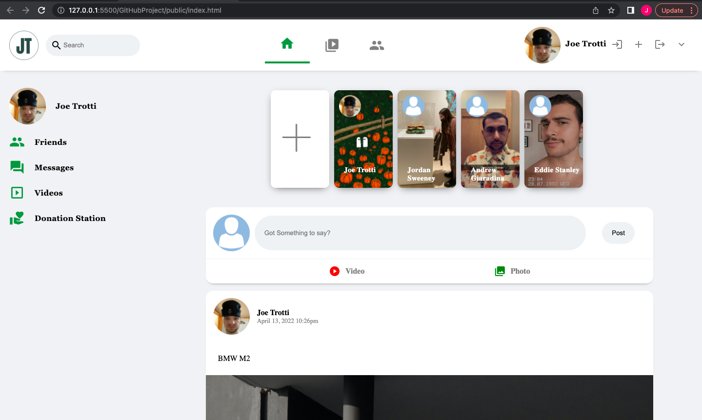

# JT Social

 A new social media platform in its early stages designed to connect with others. In the wepage's current state a *User* can register , login, and make a post. 
 Future plans for JT Social include connecting with friends, posting videos and images, leaving comments on posts, and adding a "Donation Station" designed to
 donate to weekly changing charities.
 
 ## Installation and Access
 
 1) Download JT Social to your device from GitHub and make sure node.js is insalled.
 2) Open your terminal and type `npm install express` to install express.
 3) Next enter `npm install nodemon ——save—dev` to install nodemon.
 4) To run this using nodemon type `npm run dev`
 
 
       
